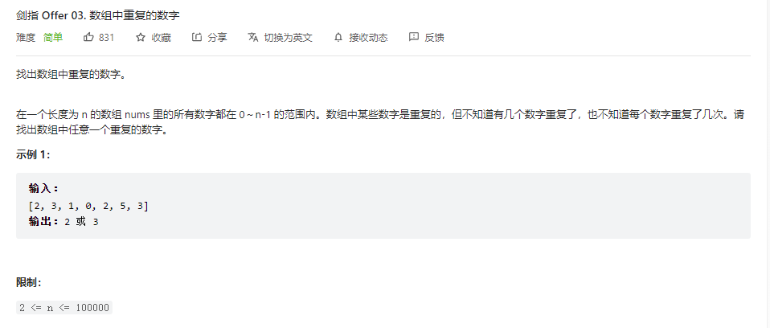
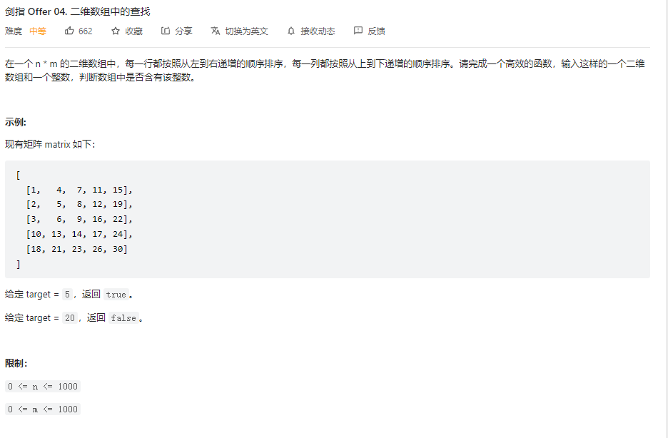
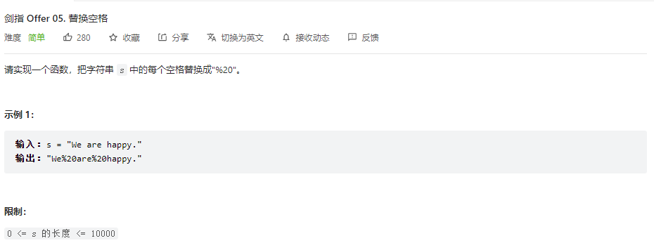
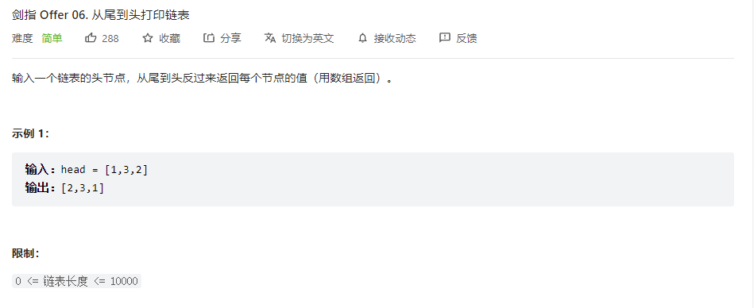
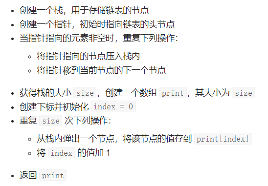
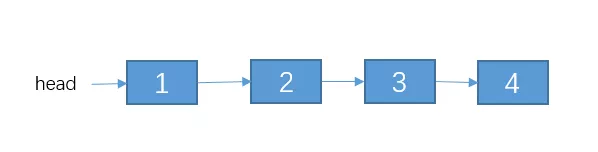
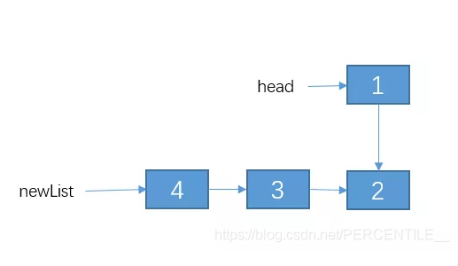
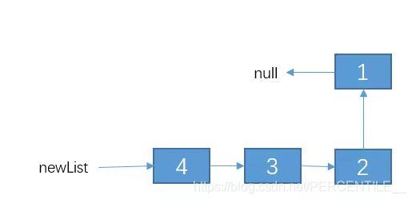
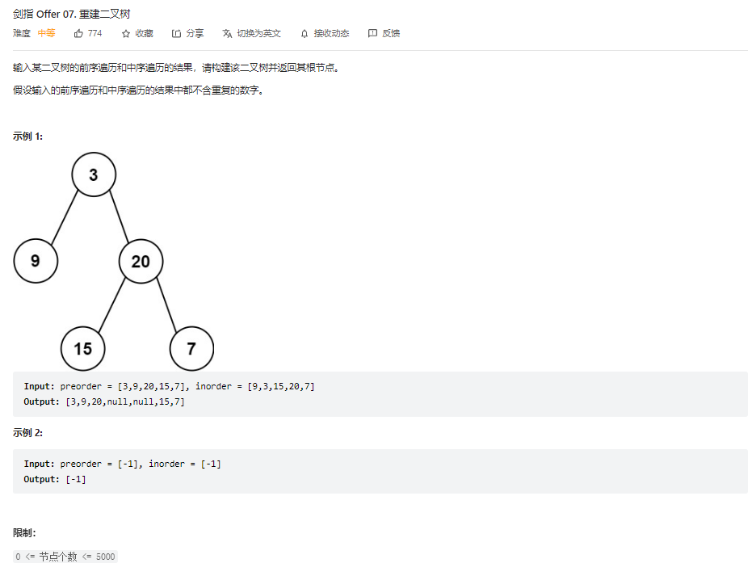

### 剑指Offer刷题笔记

#### 03.数组中重复的数字




##### 方法一：遍历数组

>由于只需要找出数组中任意一个重复的数字，因此遍历数组，遇到重复的数字即返回。为了判断一个数字是否重复遇到，使用集合存储已经遇到的数字，如果遇到的一个数字已经在集合中，则当前的数字是重复数字。
>
>初始化集合为空集合，重复的数字 repeat = -1
>遍历数组中的每个元素：
>将该元素加入集合中，判断是否添加成功
>如果添加失败，说明该元素已经在集合中，因此该元素是重复元素，将该元素的值赋给 repeat，并结束遍历
>返回 repeat
>
>```java
>public int findRepeatNumber(int[] nums) {
>    Set<Integer> set = new HashSet<>();
>    int repeat = -1;
>    for (int i = 0; i < nums.length; i++) {
>        if (!set.add(nums[i])) {
>            repeat = nums[i];
>            break;
>        }
>    }
>    return repeat;
>}
>```
>
>###### 复杂性分析
>
>时间复杂度：O(n)。
>遍历数组一遍。使用哈希集合（HashSet），添加元素的时间复杂度为 O(1)，故总的时间复杂度是 O(n)。
>空间复杂度：O(n)。不重复的每个元素都可能存入集合，因此占用 O(n)额外空间。

#### 04. 二维数组中的查找



##### 方法一：暴力

>如果不考虑二维数组排好序的特点，则直接遍历整个二维数组的每一个元素，判断目标值是否在二维数组中存在。
>
>依次遍历二维数组的每一行和每一列。如果找到一个元素等于目标值，则返回 true。如果遍历完毕仍未找到等于目标值的元素，则返回 false。
>
>```java
>public boolean findNumberIn2DArray1(int[][] matrix, int target) {
>    if (matrix == null || matrix.length == 0 || matrix[0].length == 0) {
>        return false;
>    }
>    int rows = matrix.length, columns = matrix[0].length;
>    for (int i = 0; i < rows; i++) {
>        for (int j = 0; j < columns; j++) {
>            if (matrix[i][j] == target) {
>                return true;
>            }
>        }
>    }
>    return false;
>}
>```
>
>**复杂度分析**
>
>- 时间复杂度：O(nm)。二维数组中的每个元素都被遍历，因此时间复杂度为二维数组的大小。
>- 空间复杂度：O(1)。

##### 方法一：线性查找

>由于给定的二维数组具备每行从左到右递增以及每列从上到下递增的特点，当访问到一个元素时，可以排除数组中的部分元素。
>
>从二维数组的右上角开始查找。如果当前元素等于目标值，则返回 true。如果当前元素大于目标值，则移到左边一列。如果当前元素小于目标值，则移到下边一行。
>
>可以证明这种方法不会错过目标值。如果当前元素大于目标值，说明当前元素的下边的所有元素都一定大于目标值，因此往下查找不可能找到目标值，往左查找可能找到目标值。如果当前元素小于目标值，说明当前元素的左边的所有元素都一定小于目标值，因此往左查找不可能找到目标值，往下查找可能找到目标值。
>
>若数组为空，返回 false
>初始化行下标为 0，列下标为二维数组的列数减 1
>重复下列步骤，直到行下标或列下标超出边界
>	获得当前下标位置的元素 num
>	如果 num 和 target 相等，返回 true
>	如果 num 大于 target，列下标减 1
>	如果 num 小于 target，行下标加 1
>循环体执行完毕仍未找到元素等于 target ，说明不存在这样的元素，返回 false`
>
>```java
>public boolean findNumberIn2DArray2(int[][] matrix, int target) {
>    if (matrix == null || matrix.length == 0 || matrix[0].length == 0) {
>        return false;
>    }
>    int rows = matrix.length, columns = matrix[0].length;
>    // 右上角节点
>    int row = 0, column = columns - 1;
>    // 左移下移遍历
>    while (row < rows && column >= 0) {
>        int num = matrix[row][column];
>        if (num == target) {
>            return true;
>        } else if (num > target) {
>            column--;
>        } else {
>            row++;
>        }
>    }
>    return false;
>}
>```
>
>复杂度分析
>
>时间复杂度：O(n+m)。访问到的下标的行最多增加 n 次，列最多减少 m 次，因此循环体最多执行 n + m 次。
>空间复杂度：O(1)。

#### 05. 替换空格



##### 方法一：Java.String Api

>```java
>public String replaceSpace(String s) {
>    return s.replace(" ","%20");
>}
>```

##### 方法二：字符数组

>由于每次替换从 1 个字符变成 3 个字符，使用字符数组可方便地进行替换。建立字符数组地长度为 s 的长度的 3 倍，这样可保证字符数组可以容纳所有替换后的字符。
>
>获得 s 的长度 length
>创建字符数组 array，其长度为 length * 3
>初始化 size 为 0，size 表示替换后的字符串的长度
>从左到右遍历字符串 s
>	获得 s 的当前字符 c
>	如果字符 c 是空格，则令 array[size] = '%'，array[size + 1] = '2'，array[size + 2] = '0'，并将 size 的值加 3
>	如果字符 c 不是空格，则令 array[size] = c，并将 size 的值加 1
>	遍历结束之后，size 的值等于替换后的字符串的长度，从 array 的前 size 个字符创建新字符串，并返回新字符串
>
>```java
>public String replaceSpace(String s) {
>    int length = s.length();
>    char[] array = new char[length * 3];
>    int size = 0;
>    for (int i = 0; i < length; i++) {
>        char c = s.charAt(i);
>        if (c == ' ') {
>            array[size++] = '%';
>            array[size++] = '2';
>            array[size++] = '0';
>        } else {
>            array[size++] = c;
>        }
>    }
>    String newStr = new String(array, 0, size);
>    return newStr;
>}
>```
>
>**复杂性分析**
>
>- 时间复杂度：O(n)。遍历字符串 `s` 一遍。
>- 空间复杂度：O(n)。额外创建字符数组，长度为 `s` 的长度的 3 倍。

#### 06.从头到尾打印链表



##### 方法一：栈

>栈的特点是后进先出，即最后压入栈的元素最先弹出。考虑到栈的这一特点，使用栈将链表元素顺序倒置。从链表的头节点开始，依次将每个节点压入栈内，然后依次弹出栈内的元素并存储到数组中。
>
>
>
>```java
>public int[] reversePrint1(ListNode head) {
>    Stack<ListNode> stack  = new Stack<>();
>    ListNode temp = head;
>    while (temp != null) {
>        stack.push(temp);
>        temp = temp.next;
>    }
>    int size = stack.size();
>    int[] print = new int[size];
>    for (int i = 0; i < size; i++) {
>        print[i] = stack.pop().val;
>    }
>    return print;
>}
>```
>
>复杂性分析
>
>时间复杂度：O(n)。正向遍历一遍链表，然后从栈弹出全部节点，等于又反向遍历一遍链表。
>空间复杂度：O(n)。额外使用一个栈存储链表中的每个节点。

##### 方法二：列表

>```java
>public int[] reversePrint2(ListNode head) {
>    ArrayList<Integer> list = new ArrayList<>();
>    while (head != null) {
>        list.add(head.val);
>        head = head.next;
>    }
>    int size = list.size();
>    int[] array = new int[size];
>    for (int i = 0; i < size; i++) {
>        array[i] = list.get(size - i -1);
>    }
>    return array;
>}
>```

##### 方法三：递归反转链表

>###### 递归的三大要素
>
>第一要素：明确你这个函数想要干什么，即函数的功能是什么
>
>第二要素：寻找递归结束条件，即找出当参数为啥值时，结束递归，把结果返回
>
>第三要素：找出函数的等价关系式，即不断缩小参数的范围
>
>### [反转链表](https://so.csdn.net/so/search?q=反转链表&spm=1001.2101.3001.7020)
>
>第一步 明确函数的功能
>假设函数 reverseList(head) 的功能是反转但[链表](https://so.csdn.net/so/search?q=链表&spm=1001.2101.3001.7020)，其中 head 表示链表的头节点。代码如下：
>
>```java
>Node reverseList(Node head){
>}
>```
>
>第二步 寻找结束条件
>当链表只有一个节点，或者如果是空表的话，你应该知道结果吧？直接啥也不用干，直接把 head 返回呗。代码如下：
>
>```java
>Node reverseList(Node head){
>    if(head == null || head.next == null){
>        return head;
>    }
>}
>```
>
>第三步 寻找等价关系
>这个的等价关系不像 n 是个数值那样，比较容易寻找。但是我告诉你，它的等价条件中，一定是范围不断在缩小，对于链表来说，就是链表的节点个数不断在变小，所以，如果你实在找不出，你就先对 reverseList(head.next) 递归走一遍，看看结果是咋样的。例如链表节点如下
>
>
>
>我们就缩小范围，先对 2->3->4递归下试试，即代码如下
>
>```java
>Node reverseList(Node head){
>    if(head == null || head.next == null){
>        return head;
>    }
>    // 我们先把递归的结果保存起来，先不返回，因为我们还不清楚这样递归是对还是错。，
>    Node newList = reverseList(head.next);
>}
>```
>
>我们在第一步的时候，就已经定义了 reverseLis t函数的功能可以把一个单链表反转，所以，我们对 2->3->4反转之后的结果应该是这样：
>
>
>
>我们把 2->3->4 递归成 4->3->2。不过，1 这个节点我们并没有去碰它，所以 1 的 next 节点仍然是连接这 2。
>
>接下来呢？该怎么办？
>
>其实，接下来就简单了，我们接下来只需要把节点 2 的 next 指向 1，然后把 1 的 next 指向 null,不就行了？，即通过改变 newList 链表之后的结果如下：
>
>
>
>也就是说，reverseList(head) 等价于 **reverseList(head.next)** + **改变一下1，2两个节点的指向**。好了，等价关系找出来了，代码如下(有详细的解释)：
>
>```java
>// 用递归的方法反转链表
>public static Node reverseList(Node head){
>    // 1.递归结束条件
>    if (head == null || head.next == null) {
>        return head;
>    }
>    // 递归反转 子链表
>    Node newList = reverseList(head.next);
>    // 改变 1，2节点的指向。
>    // 通过 head.next获取节点2
>    Node t1  = head.next;
>    // 让 2 的 next 指向 1
>    t1.next = head;
>    // 1 的 next 指向 null.
>    head.next = null;
>    // 把调整之后的链表返回。
>    return newList;
>
>}
>```

#### 07.重建二叉树



##### 方法一：


