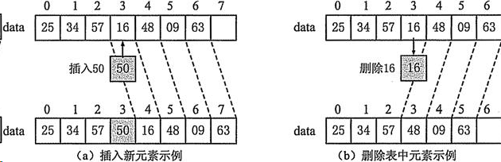

## 数据结构基础

### 线性表

线性表是最基本的一种数据结构，它是表示一组相同类型数据的有限序列，你可以把它与数组进行参考，但是它并不是数组，线性表是一种表结构，它能够支持数据的插入、删除、更新、查询等，同时数组可以随意存放在数组中任意位置，而线性表只能依次有序排列，不能出现空隙，因此，我们需要进一步的设计。

#### 顺序表

将数据依次存储在连续的整块物理空间中，这种存储结构称为`顺序存储结构`，而以这种方式实现的线性表，我们称为`顺序表`。

同样的，表中的每一个个体都被称为`元素`，元素左边的元素（上一个元素），称为`前驱`，同理，右边的元素（后一个元素）称为`后驱`。



顺序表优缺点：

* 访问速度快，随机访问性能高
* 插入和删除的效率低下，极端情况下需要变更整个表
* 不易扩充，需要复制并重新创建数组

抽象模型

```java
/**
 * 线性表抽象类
 * @param <E> 存储的元素(Element)类型
 */
public abstract class AbstractList<E> {
    /**
     * 获取表的长度
     * @return 顺序表的长度
     */
    public abstract int size();

    /**
     * 添加一个元素
     * @param e 元素
     * @param index 要添加的位置(索引)
     */
    public abstract void add(E e, int index);

    /**
     * 移除指定位置的元素
     * @param index 位置
     * @return 移除的元素
     */
    public abstract E remove(int index);

    /**
     * 获取指定位置的元素
     * @param index 位置
     * @return 元素
     */
    public abstract E get(int index);
}
```

#### 链表

数据分散的存储在物理空间中，通过一根线保存着它们之间的逻辑关系，这种存储结构称为`链式存储结构`

实际上，就是每一个结点存放一个元素和一个指向下一个结点的引用（C语言里面是指针，Java中就是对象的引用，代表下一个结点对象）

链表优缺点：

* 插入和删除效率高，只需要改变连接点的指向即可
* 动态扩充容量，无需担心容量问题
* 访问元素需要依次寻找，随机访问元素效率低下

##### 双向链表

#### 栈

栈遵循先入后出原则，只能在线性表的一端添加和删除元素。


向栈中插入一个元素时，称为`入栈（压栈）`，移除栈顶元素称为`出栈`

抽象模型

```java
/**
 * 抽象类型栈
 * @param <E> 元素类型
 */
public abstract class AbstractStack<E> {

    /**
     * 出栈操作
     * @return 栈顶元素
     */
    public abstract E pop();

    /**
     * 入栈操作
     * @param e 元素
     */
    public abstract void push(E e);
}
```

#### 队列

队列同样也是受限制的线性表，先进先出的属性。

抽象模型

```java
/**
 * 抽象队列
 * @param <E>
 */
public abstract class AbstractQueue<E> {

    /**
     * 进队操作
     * @param e 元素
     */
    public abstract void offer(E e);

    /**
     * 出队操作
     * @return 元素
     */
    public abstract E poll();
}
```

### 树

